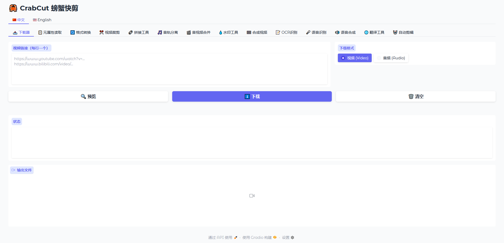
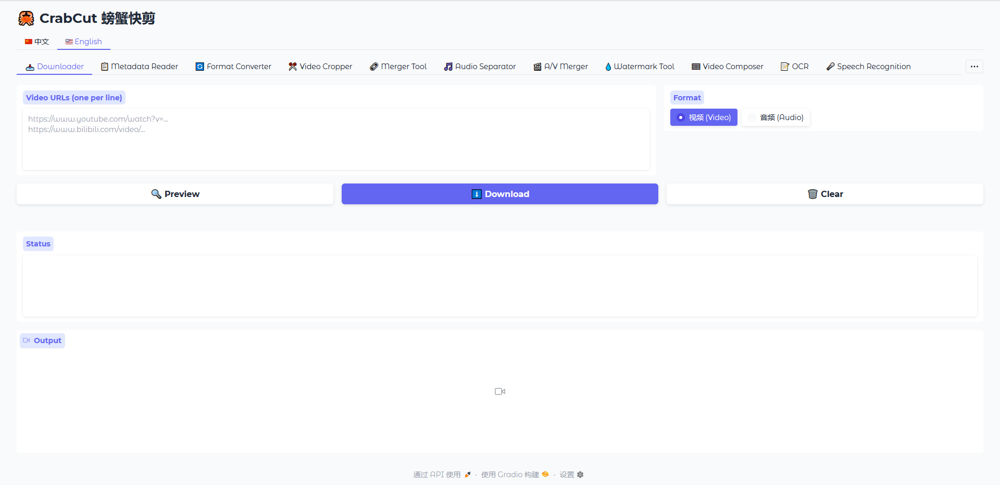

# 🦀 CrabCut 螃蟹快剪

[中文](#中文) | [English](#english)


### 截图 ScreenShot



---

<a name="中文"></a>

## 中文

### 简介

CrabCut 螃蟹快剪是一个功能丰富的视频/音频处理工具集，基于 Gradio 构建，提供友好的 Web 界面。


### 功能列表

| 功能 | 描述 |
|------|------|
| 📥 视频下载 | 支持多个视频平台的视频下载 |
| 📋 元数据 | 查看音视频文件的详细信息 |
| 🔄 格式转换 | 音视频格式互转，图片转视频 |
| ✂️ 裁剪 | 视频裁剪、截取片段 |
| 🔗 合并 | 多个视频/音频文件合并 |
| 🎵 音视频分离 | 提取音轨、人声分离 |
| 🎬 音视频合并 | 音频与视频合成、替换音轨 |
| 💧 水印 | 添加图片/文字水印、模糊处理 |
| 🎞️ 视频合成 | 添加字幕、背景音乐 |
| 📝 OCR | 图片/PDF 文字识别 |
| 🎤 ASR | 语音识别转文字 |
| 🔊 TTS | 文字转语音 |
| 🌐 翻译 | 文本、音频、视频翻译 |
| 🤖 自动剪辑 | 自动识别口播片段，剪切静音 |

### 安装

```bash
# 克隆项目
git clone https://github.com/your-repo/CrabCut.git
cd CrabCut

# 安装依赖
pip install -r requirements.txt
```

### 运行

```bash
# 方式一：Tabs 模式（单页应用）
python app.py

# 方式二：Route 模式（多页面，支持独立 URL）
python launcher.py
```

### 依赖说明

| 依赖 | 用途 |
|------|------|
| gradio | Web 界面框架 |
| yt-dlp | 视频下载 |
| Pillow | 图片处理 |
| easyocr | OCR 识别 |
| pymupdf | PDF 处理 |
| edge-tts | TTS 语音合成 |
| funasr | FunASR 语音识别 |
| faster-whisper | Whisper 语音识别 |
| audio-separator | 人声分离 |
| argostranslate | 离线翻译 |

### 项目结构

```
CrabCut/
├── app.py              # Tabs 模式入口
├── launcher.py         # Route 模式入口
├── config.py           # 配置文件
├── requirements.txt    # 依赖列表
├── pages/              # 页面模块
│   ├── downloader.py
│   ├── asr.py
│   ├── tts.py
│   └── ...
├── utils/              # 工具模块
│   ├── asr.py
│   ├── tts.py
│   ├── i18n.py
│   └── ...
├── i18n/               # 国际化翻译
│   ├── zh.json
│   └── en.json
└── outputs/            # 输出目录
```

---

<a name="english"></a>

## English

### Introduction

CrabCut is a feature-rich video/audio processing toolkit built with Gradio, providing a user-friendly web interface.

### Features

| Feature | Description |
|---------|-------------|
| 📥 Downloader | Download videos from multiple platforms |
| 📋 Metadata | View detailed media file information |
| 🔄 Converter | Convert between audio/video formats, images to video |
| ✂️ Cropper | Crop video, extract clips |
| 🔗 Merger | Merge multiple video/audio files |
| 🎵 Separator | Extract audio tracks, vocal separation |
| 🎬 AV Merger | Combine audio with video, replace audio track |
| 💧 Watermark | Add image/text watermarks, blur effects |
| 🎞️ Composer | Add subtitles, background music |
| 📝 OCR | Text recognition from images/PDFs |
| 🎤 ASR | Speech-to-text recognition |
| 🔊 TTS | Text-to-speech synthesis |
| 🌐 Translate | Text, audio, video translation |
| 🤖 Auto Cut | Auto-detect speech segments, remove silence |

### Installation

```bash
# Clone the repository
git clone https://github.com/your-repo/CrabCut.git
cd CrabCut

# Install dependencies
pip install -r requirements.txt
```

### Usage

```bash
# Option 1: Tabs mode (single-page app)
python app.py

# Option 2: Route mode (multi-page, independent URLs)
python launcher.py
```

### Dependencies

| Package | Purpose |
|---------|---------|
| gradio | Web interface framework |
| yt-dlp | Video downloading |
| Pillow | Image processing |
| easyocr | OCR recognition |
| pymupdf | PDF processing |
| edge-tts | TTS synthesis |
| funasr | FunASR speech recognition |
| faster-whisper | Whisper speech recognition |
| audio-separator | Vocal separation |
| argostranslate | Offline translation |

### Project Structure

```
CrabCut/
├── app.py              # Tabs mode entry
├── launcher.py         # Route mode entry
├── config.py           # Configuration
├── requirements.txt    # Dependencies
├── pages/              # Page modules
│   ├── downloader.py
│   ├── asr.py
│   ├── tts.py
│   └── ...
├── utils/              # Utility modules
│   ├── asr.py
│   ├── tts.py
│   ├── i18n.py
│   └── ...
├── i18n/               # Internationalization
│   ├── zh.json
│   └── en.json
└── outputs/            # Output directory
```

---

## License / 许可证

MIT License
